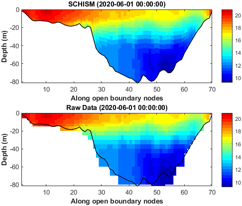

# SCHISM-toolbox (v1.1-beta)

This is a MATLAB toolbox designed for the Semi-implicit Cross-scale Hydroscience Integrated System Model ([SCHISM](http://ccrm.vims.edu/schismweb/)).

Last updated on 6 Nov 2024 by [Wenfan Wu](https://www.researchgate.net/profile/Wenfan-Wu/research), CCRM, Virginia Institute of Marine Science.

### New features!!!

- work for mixed triangular/quadrangular grid
- work for cartesian or geographic coordinates
- map projection is allowed for variable visualization
- nudging functions are provided.

More details can be found in the [**Changelog.md**](./Changelog.md) file.

## Prerequisites

**MATLAB Version: 2014b and above**

**Official Add-Ons (Mandatory):**   
`Image Processing Toolbox` (drawpolygon, drawline);   
`Mapping Toolbox` (ispolycw, distance, projcrs, profwd)   

**Public packages (Recommended):**   
[`OceanMesh2D`](https://github.com/CHLNDDEV/OceanMesh2D) 

> Notes: **OceanMesh2D** is only required when you're using <font color="green">**mesh2schism.m**</font> to load MAT file created by OceanMesh2D.

<br>

## Workflow

The following steps show a complete workflow to prepare input files with this toolbox. Refer to the first example (<font color="green">**Exp1_BYS_main.m**</font>) in this toolbox for more details.

### Step-1: Load the mesh grid

This part aims to load the mesh grid created by OceanMesh2D or SMS, and then all the grid info. will be stored in a datastruct named '**Mobj**' (see [**mesh_object.png**](mesh_object.png) for more details).

```matlab
clc;clearvars
% options-1: load mesh grid from OceanMesh2D
mesh_file = 'Exp1_BYS\inputs\BYS_20814.mat'; % NEED TO BE CHANGED

% option-2: load mesh grid from SMS
mesh_file = 'Exp1_BYS\inputs\BYS_20814.2dm'; % NEED TO BE CHANGED

Mobj = mesh2schism(mesh_file); 
Mobj.expname = 'Exp1_BYS';      
Mobj.time = (datetime(2020,6,1):hours(1):datetime(2020,6,10))'; 
Mobj.rundays = days(Mobj.time(end)-Mobj.time(1)+1); 
Mobj.dt = 150;  % dt (secs), the same as in param.nml
Mobj.coord = 'geographic';  % geographic or Cartesian coordinate
```

> All input files generated afterwards will be placed in the directory where the **mesh_file** is located; 
> 
> <span style="color:cornflowerblue;">If your mesh grid is generated from softwares other than OceanMesh2D or SMS, just use the '**read_schism_hgrid.m**' function to generate the '**Mobj**' datastruct, and the remaining workflow is the same. Refer to **Exp3_CORIE_LSC2.m** for more details.</span>

<br>

### Step-2: Activated modules

This part aims to select activated modules for your simulation.

```matlab
Mobj = call_schism_tracers(Mobj);
```

> This is a purely hydrodynamic case and thus there are only two activated tracers (temp & salt). 

<br>

### Step-3: Horizontal grids

This part aims to visualize the horizontal grids and generate hgrid.gr3/hgrid.ll file.

```matlab
figure('Color', 'w')
disp_schism_hgrid(Mobj, [1 0])
axis image
hold on
plot_schism_bnds(Mobj, [1 1 1], 'Color', 'k')

% write hgrid.gr3 and hgrid.ll files 
write_schism_hgrid(Mobj)
```

<div align="center">
  
</div>
<p align="center"><strong>Figure 1</strong>. Model domain.</p>

<br>

### Step-4: Check the grid quality

This part aims to check the inverse CFL constraints and hydrostatic assumption.

```matlab
% check the invese CFL constraints
check_schism_metrics(Mobj);

% display the Max. acceptable resolutions as a function of water depth 
calc_schism_CFL(Mobj)

% check the hydrostatic assumption
check_schism_hydrostatic(Mobj);
```

> For more details about the grid quality, please refer to the SCHISM manual.

<div align="center">
  
</div>

<p align="center"><strong>Figure 2</strong>. Check the inverse CFL constraints for horizontal grids.</p>

<div align="center">
  
</div>

<p align="center"><strong>Figure 3</strong>. The Max. acceptable resolutions as a function of water depth .</p>

<div align="center">
  
</div>

<p align="center"><strong>Figure 4</strong>. The nodes that violate the hydrostatic assumption.</p>

<br>

### Step-5: Vertical grids

This part aims to generate the vertical grids (vgrid.in), and visualize the vertical layers at a given transect.

```matlab
% option-1: LSC2 coordinates
dep_edges = [10, 20, 30, 45, 55, 65, 75, 90];
dep_nums =  [20 21 22 23 24 25 27 28];
Mobj = gen_schism_LSC2(Mobj, dep_edges, dep_nums, [4 5 3 5], 0.25);

% option-2: SZ coordinates
s_consts = [10, 0.7, 5, 20];
zcors = 20:2:(fix(max(Mobj.depth))+10);
Mobj = gen_schism_SZ(Mobj, s_consts, zcors);

% check the quality of vertical grids
% draw a line on the map and press ENTER
figure('Color', 'w')
disp_schism_hgrid(Mobj, [1 0], 'EdgeAlpha', 0.05, 'LineWidth', 0.5);
auto_center
sect_info = def_schism_transect(Mobj, -1, 0.01);

% display the vertical layers on your selected transect
disp_schism_vgrid(Mobj, sect_info)

% Write the vgrid.in file. 
write_schism_vgrid(Mobj, 'v5.10');
```

> Draw a line on the map and press **ENTER**, this part will visualize the vertical layers of selected transect. 
> 
> The format of vgrid.in has changed since v5.10, and thus you need to specify the version number here (v5.10 or v5.9). v5.10 is the default.
> 
> The function <span style="color:green;">**def_schism_transect.m**</span> provides a variety of methods to define the transect (e.g. straight line, broken line, single points), see the usage of this function for more details.

 

<p align="center"><strong>Figure 5</strong>. (left) The selected transect; (right) vertical layers along the transect.</p>

<br>

### Step-6: River inputs

This part aims to add river inputs in the form of element sources (e.g., source.nc).

```matlab
SS = def_schism_source(Mobj, [1 0], 'rebuild', 'on');
river_info = match_rivers(SS.source.lonc, SS.source.latc, SS.source.elems);

river_info = add_river_runoff(river_info, Mobj.time, 'real_time');

tracer_list = {'temp', 'salt'};
river_info = add_river_tracer(river_info, tracer_list, 'real_time');

D = prep_river_source(river_info, tracer_list);
write_schism_source_nc(Mobj, D,  tracer_list)
```

> Left-click the points at the center of elements to select river sources (activate the datatips mode first), and press **SHIFT** to select multiple points simultaneously. The selected river sources will be saved as a MAT file named <span style="color:blue;">**source_sink.mat**</span>.
> 
> Two things should be done before preparing your own application.
> 
> 1) prepare your own <span style="color:blue;">**example_river_data.mat**</span> file according to your needs.
> 
> 2) add corresponding rivers in the <span style="color:green;">**match_rivers.m**</span> function.
> 
> River can also be added in the form of open boundaries but it is not supported in this toolbox so far.

<br>

### Step-7: Initial Conditions

This part aims to prepare the initial fields (e.g., elev.ic, temp.ic, and hotstart.nc).

```matlab
% DS contains the original initial fields with a fixed format:
% 1) 'lon', 'lat', 'depth' vectors must be in ascending order;
% 2) 'depth' vector must be positive; and ensure the range of lon/lat covers you model domain
% 3) 'var' must have dimensions of lon*lat or lon*lat*depth.

% option-1: real-time initial field from hycom.
DS = prep_schism_init(Mobj, 'hycom_bys'); 

% option-2: monthly clim. initial field from hycom.
% DS = prep_schism_init(Mobj, 'hycom_clim'); 

% option-3: directly download the real-time hycom data from the internet
% DS = prep_schism_init(Mobj, 'hycom_online'); 

varList = {'ssh', 'temp', 'salt'};  % it can be changed if you only want to interpolate for partial variables.
InitCnd = interp_schism_init(Mobj, DS, varList);

% check the interpolation
check_schism_init(Mobj, DS, InitCnd, 'temp')

% option-1: space-varying but vertically uniform initial field (temp.ic&salt.ic)
write_schism_ic(Mobj, 'elev', InitCnd.ssh)
write_schism_ic(Mobj, 'temp', InitCnd.temp(:,1))
write_schism_ic(Mobj, 'salt', InitCnd.salt(:,1))

% option-2: 3D initial fields (hotstart.nc)
start_time = Mobj.time(1);
Hotstart = write_schism_hotstart(Mobj, InitCnd, start_time);
```

> <span style="color:green;">**prep_schism_init.m**</span> is a simple wrapper function, and thus you can easily add more data sources in it according to your needs. Just make sure the format of **DS** meets the requirements given above.

<div align="center">
  
</div>

<p align="center"><strong>Figure 6</strong>. Check the surface and bottom temperature interpolation in the initial field.</p>

<br>

### Step-8: Boundary Conditions

This part aims to prepare the boundary inputs (e.g. elev2d.th.nc and TEM_3D.th.nc).

```matlab
% option-1: prepare real-time boundary inputs using hycom data.
DS = prep_schism_bdry(Mobj, 'hycom_bys');

% option-2: prepare monthly clim. boundary inputs using hycom data.
% DS = prep_schism_bdry(Mobj, 'hycom_clim');

BdryCnd = interp_schism_bdry(Mobj, DS);

write_schism_th_nc(Mobj, 'elev2D', BdryCnd)
write_schism_th_nc(Mobj, 'TEM_3D', BdryCnd)
write_schism_th_nc(Mobj, 'SAL_3D', BdryCnd)
write_schism_th_nc(Mobj, 'uv3D', BdryCnd)

% check the temperature interpolation at the begining
check_schism_bdry(Mobj, DS, BdryCnd, 'temp', 1)

% check the consistency between initial fields and boundary inputs
check_schism_icbc(Mobj, 'temp', Mobj.maxLev)
```

> This step can be quite time-consuming if you choose real-time boundary inputs with a high time resolution, especially when the timespan is long.

<div align="center">
  
</div>

<p align="center"><strong>Figure 7</strong>. Check the temperature interpolation along the open boundary on the first day.</p>

<div align="center">
  
</div>

<p align="center"><strong>Figure 8</strong>. Check the consistency of SST in the initial field and the boundary input.</p>

<br>

### Step-9: Tidal forcing

This part aims to implement tidal forcing at the open boundary (e.g. bctides.in).

```matlab
% extract tidal forcing
tideList = {'S2','M2','N2','K2', 'K1','P1','O1','Q1'};
TideForc = get_fes2014_tide(Mobj, tideList);   

% kill the potential NaN values adjacent to the coast
field_list = fieldnames(TideForc);
for ii = 2:numel(field_list)
    tide_var = field_list{ii};
    TideForc.(tide_var) = fillmissing(TideForc.(tide_var), 'previous', 1);
end

TideForc = add_nodal_factors(Mobj, TideForc);
TideForc.cutoff_depth = 10;

bc_flags = [5 5 4 4];
TideForc.nf_temp = 0.8;
TideForc.nf_salt = 0.8;

write_schism_bctides(Mobj, TideForc, bc_flags)
```

> Download the fes2014 tidal products first, and change the directory in the function <span style="color:green;">**get_fes2014_tide.m**</span> (Lines 40–42).
> 
> It is easy to create another function if you want to change tide products, just make sure the returned **TidaForc** has the same format for the fields inside.

<br>

### Step-10: Bottom friction

This part aims to prepare the input files related to bottom friction (e.g., drag.gr3).

```matlab
% Type-1: roughness
z0 = 0.001;  % set constant roughness in the model domain
write_schism_gr3(Mobj, 'rough', z0)

% Type-2: drag
Cd = calc_schism_bfric(Mobj, 1, [0.07 3], 'on');
write_schism_gr3(Mobj, 'drag', Cd)

% Type-3: manning
fmc = 0.025;
write_schism_gr3(Mobj, 'rough', fmc)
```

<br>

### Step-11: Misc. files ending in gr3

This part aims to generate the input files ending in gr3 (e.g., shapiro.gr3, albedo.gr3 and so on).

```matlab
% shapiro.gr3
shapiro_val = calc_schism_shapiro(Mobj, [0.001, 0.05], 0.5, 'on');
write_schism_gr3(Mobj, 'shapiro', shapiro_val)

% windrot_geo2proj.gr3
write_schism_gr3(Mobj, 'windrot_geo2proj', 0)

% albedo.gr3
albedo_val = calc_schism_albedo(Mobj, 1, 'on');
write_schism_gr3(Mobj, 'albedo', albedo_val)

% watertype.gr3
wtypes = 5;
write_schism_gr3(Mobj, 'watertype', wtypes)

% diffmax.gr3 & diffmin.gr3
write_schism_gr3(Mobj, 'diffmax', 1)
write_schism_gr3(Mobj, 'diffmin', 1.0e-6)

% bdef.gr3
bdef_factor = zeros(size(Mobj.depth));
bdef_factor(Mobj.depth<5) = -2;
write_schism_gr3(Mobj, 'bdef', bdef_factor)

% hdif.gr3
hdif = calc_schism_hdif(Mobj, 0.25, 5e-5, 'on');
write_schism_gr3(Mobj, 'hdif', hdif)
```

> The function <span style="color:green;">**write_schism_gr3.m**</span> makes it easy to generate all the input files ending in 'gr3'.

<br>

### Step-12: Misc. files ending in prop

This part aims to prepare input files ending in prop (e.g., tvd.prop).

```matlab
tvd_flags = ones(Mobj.nElems, 1);
tvd_flags(Mobj.depthc<5) = 0;
write_schism_prop(Mobj, 'tvd', tvd_flags)

flux_flags = def_schism_fluxflag(Mobj, 2);
write_schism_prop(Mobj, 'fluxflag', flux_flags)
```

> The function <span style="color:green;">**write_schism_prop.m**</span> makes it easy to generate all the input files ending in 'prop'.

<br>

### Step-13: Atmospheric forcing

This part aims to prepare sflux files (netcdf) as atmospheric forcing.

```matlab
% AtmForc inculdes the extracted atmospheric forcing data with a fixed format:
% 1) lon/lat matrix (nLons*nLats) are generated from the meshgrid function, and in ascending order
% 2) variable matrix should be of nLons*nLats*nTimes
% 3) the 'region' and 'time' fields must cover your simulation period and model domain.

nFiles = 5; 

load('example_AtmForc_era5.mat')
write_schism_sflux(AtmForc, 'prc', nFiles)
write_schism_sflux(AtmForc, 'rad', nFiles)
write_schism_sflux(AtmForc, 'air', nFiles)
```

> nFiles is the estimated # of sflux_prc/air/rad_*.nc files. Note that the nFiles can not be too small, since the **time_steps** of each sflux nc file can not exceed 1000 by default. In addition, <span style="color:green;">**write_schism_sflux.m**</span> will slightly adjust this value to ensure that each file starts at 0 o'clock in certain day, since the 'hour' component of 'base_date' property is unused in each nc file.
> 
> AtmForc was created by the function <span style="color:green;">**get_era5_forcing.m**</span>. However, you need to modify/replace this function carefully based on your own data sources, just make sure the outputed AtmForc meets the required format above.

### Step-14: Boundary nudging (optional)

This part aims to prepare boundary nudging files (e.g., TEM/SAL_nu.nc).

```matlab
% define a boundary nuding zone (90-km width)
% 20 km is the width of max-nudging zone adjacent to the boundary
[nudge_factor, nudge_nodes] = calc_schism_nudge(Mobj, [20, 90, 4e-5], 'on');

nudge_time = Mobj.time(1):Mobj.time(end); % daily inputs
D.time = seconds(nudge_time-nudge_time(1));
D.map_to_global_node = nudge_nodes;
D.tracer_concentration = 25*ones(1,Mobj.maxLev, numel(nudge_nodes), numel(nudge_time));  % constant temperature

write_schism_gr3(Mobj, 'TEM_nudge', nudge_factor)
write_schism_nu_nc(Mobj, 'TEM', D)
```

<br>

## Notes

This toolbox was written referring to the [fvcom-toolbox](https://github.com/pwcazenave/fvcom-toolbox) developed by Dr. Geoff Cowles et al.

## Limitations (To-do List)

* This toolbox is primarily used for preparing input files related to hydrological part so far, while the other modules such as CoSiNE, ICM are not fully supported. However, many interfaces have been reserved for future extensions.
* Rivers can only be added as source points so far, although they can also be added as open boundary inflows in SCHISM.

## Copyright

This toolbox is distributed under the Apache-2.0 license. It is free to use and no profit making is allowed. 

If you encountered any problems/bugs when using this toolbox, or if you have any suggestions, please contact [wwu@vims.edu](mailto:wwu@vims.edu). Any potential co-developers are highly welcome.
