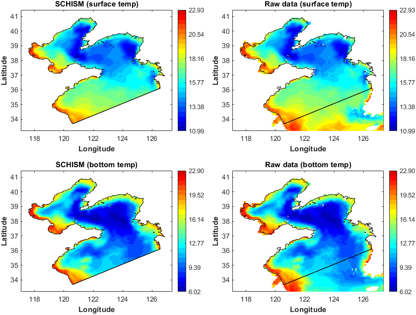

# SCHISM-toolbox (v1.2-beta)

This is a MATLAB toolbox designed for the Semi-implicit Cross-scale Hydroscience Integrated System Model ([SCHISM](http://ccrm.vims.edu/schismweb/)).

Last updated on 23 Apr 2025 by [Wenfan Wu](https://www.researchgate.net/profile/Wenfan-Wu/research), CCRM, Virginia Institute of Marine Science.

### New features!!!

- Use structure arrays in IC/BC functions to allow variable-specific open boundaries and time series.
- Add functions for the serial/parallel extraction of open boundary or nudging data.
- Improve the efficiency of many file writing functions.
- Add SAL-related functions (self-attracting and loading tide).

More details can be found in the [**Changelog.md**](./Changelog.md) file.

## Prerequisites

**MATLAB Version**: 2014b and above

**Official Add-Ons:**   

- `Image Processing Toolbox` (drawpolygon, drawline)   
- `Mapping Toolbox` (ispolycw, distance, projcrs, profwd)  
- `Parallel Computing Toolbox` (**optional**; parfor)

**Public packages:**   
[`OceanMesh2D`](https://github.com/CHLNDDEV/OceanMesh2D)(**optional**)

> Notes: **OceanMesh2D** is only required when using <font color="green">**mesh2schism.m**</font> to load MAT files generated by OceanMesh2D.

<br>

## Workflow

The following steps show a complete workflow to prepare input files with this toolbox. Refer to the first example (<font color="green">**Exp1_BYS_main.m**</font>) in the toolbox for more details.

### Step-1: Load the mesh grid

This part aims to load the mesh grid created by **OceanMesh2D** or **SMS**, and then all the grid info. will be stored in a datastruct named `Mobj` (see [**mesh_object.png**](mesh_object.png)).

```matlab
clc;clearvars
% options-1: load mesh grid from OceanMesh2D
% mesh_file = 'Exp1_BYS\inputs\BYS_20814.mat'; % NEED TO BE CHANGED

% option-2: load mesh grid from SMS
mesh_file = 'Exp1_BYS\inputs\BYS_20814.2dm'; % NEED TO BE CHANGED

Mobj = mesh2schism(mesh_file); 
Mobj.expname = 'Exp1_BYS';      
Mobj.time = (datetime(2020,6,1):hours(1):datetime(2020,6,10))'; 
Mobj.rundays = days(Mobj.time(end)-Mobj.time(1)); 
Mobj.dt = 150;  % dt (secs), the same as in param.nml
Mobj.coord = 'geographic';  % geographic or Cartesian coordinate
```

> All input files generated afterwards will be placed in the directory where the `mesh_file` is located; 
> 
> <span style="color:cornflowerblue;">If your mesh grid is generated using software other than OceanMesh2D or SMS, use the **read_schism_hgrid.m** to create `Mobj`. The rest of workflow is the same. See **Exp3_CORIE_LSC2.m** for more details.</span>

<br>

### Step-2: Activated modules

This part aims to select activated modules for your simulation.

```matlab
Mobj = call_schism_tracers(Mobj);
```

> This is a purely hydrodynamic case and thus there are only two activated tracers (temp & salt). 

<br>

### Step-3: Horizontal grids

This part aims to visualize the horizontal grids and generate hgrid.gr3/hgrid.ll file.

```matlab
figure('Color', 'w')
disp_schism_hgrid(Mobj, [1 0])
axis image
hold on
plot_schism_bnds(Mobj, [1 1 1], 'Color', 'k')

% write hgrid.gr3 and hgrid.ll files 
write_schism_hgrid(Mobj)
```

<div align="center">
  
</div>
<p align="center"><strong>Figure 1</strong>. Model domain.</p>

<br>

### Step-4: Check the grid quality

This part aims to check the inverse CFL constraints and hydrostatic assumption.

```matlab
% check the inverse CFL constraints
check_schism_CFL(Mobj);

% check the hydrostatic assumption
check_schism_hydrostatic(Mobj);
```

> For more details about the grid quality, please refer to the SCHISM manual.

<div align="center">
  
</div>

<p align="center"><strong>Figure 2</strong>. Check the inverse CFL constraints for horizontal grids.</p>

<div align="center">
  
</div>

<p align="center"><strong>Figure 3</strong>. The theoretical coarsest resolutions as a function of water depth.</p>

<div align="center">
  
</div>

<p align="center"><strong>Figure 4</strong>. The nodes that violate the hydrostatic assumption.</p>

<br>

### Step-5: Vertical grids

This part aims to generate the vertical grids (vgrid.in), and visualize vertical layers at the given transect.

```matlab
% option-1: LSC2 coordinates
dep_edges = [10, 20, 30, 45, 55, 65, 75, 90];
dep_nums =  [20 21 22 23 24 25 27 28];
Mobj = gen_schism_LSC2(Mobj, dep_edges, dep_nums, [4 5 3 5], 0.25);

% option-2: SZ coordinates
% s_consts = [10, 0.7, 5, 20];
% zcors = 20:2:(fix(max(Mobj.depth))+10);
% Mobj = gen_schism_SZ(Mobj, s_consts, zcors);

% check the quality of vertical grids
% draw a line on the map and press ENTER
figure('Color', 'w')
disp_schism_hgrid(Mobj, [1 0], 'EdgeAlpha', 0.05, 'LineWidth', 0.5);
auto_center
sect_info = def_schism_transect(Mobj, -1, 0.01);

% display the vertical layers on your selected transect
disp_schism_vgrid(Mobj, sect_info)

% Write the vgrid.in file. 
write_schism_vgrid(Mobj, 'v5.10');
```

> Draw a line on the map and press **ENTER**, this part will visualize the vertical layers of selected transect. 
> 
> The format of vgrid.in has changed since v5.10, and thus you need to specify the version number here (v5.10 or v5.9). v5.10 is the default.
> 
> <span style="color:green;">**def_schism_transect.m**</span> provides a variety of methods to define the transect (e.g., straight line, broken line, single points), see the usage of this function for more details.

 

<p align="center"><strong>Figure 5</strong>. (left) The selected transect; (right) vertical layers along the transect.</p>

<br>

### Step-6: River inputs

This part aims to add river inputs in the form of element sources (e.g., source.nc).

```matlab
SS = def_schism_source(Mobj, [1 0], 'rebuild', 'on'); % select Yellow River Mouth here
river_info = match_rivers(SS.source.lonc, SS.source.latc, SS.source.elems);

river_info = add_river_runoff(river_info, Mobj.time, 'real_time');

tracer_list = {'temp', 'salt'};
river_info = add_river_tracer(river_info, tracer_list, 'real_time');

D = prep_river_source(river_info, tracer_list);
write_schism_source_nc(Mobj, D,  tracer_list)
```

> Left-click the points at the center of elements to select river sources (activate the datatips mode first), and press **SHIFT** to select multiple points simultaneously. The selected river sources will be saved as a MAT file named <span style="color:blue;">**source_sink.mat**</span>.
> 
> Two things should be done before preparing your own application.
> 
> 1) prepare your own <span style="color:blue;">**example_river_data.mat**</span> file according to your needs.
> 
> 2) add corresponding rivers in the <span style="color:green;">**match_rivers.m**</span> function.
> 
> If you want to add rivers in the form of open boundaries, please refer to <span style="color:green;">**add_schism_obc.m**</span> function.

<br>

### Step-7: Initial Conditions

This part aims to prepare the initial fields (e.g., elev.ic, temp.ic, ts.ic, and hotstart.nc).

```matlab
% DS contains raw data in a standardized format:
% 1) 'Lon', 'Lat', and 'Depth' vectors must be in ascending order;
% 2) 'Depth' must be positive; ensure the 'Lon' and 'Lat' ranges fully cover your model domain;
% 3) variable matrix ('Data') must have dimensions of either [lon x lat] or [lon x lat x depth] above.

% option-1: real-time hycom data.
DS = prep_schism_init(Mobj, 'hycom_bys'); 

% option-2: monthly climatology hycom data.
% DS = prep_schism_init(Mobj, 'hycom_bys_clim'); 

% option-3: directly download real-time hycom data from the internet.
% DS = prep_schism_init(Mobj, 'hycom_online'); 

varList = {'ssh', 'temp', 'salt'};  % it can be changed if you only want to interpolate for partial variables.
InitCnd = interp_schism_init(Mobj, DS, varList);

% check the interpolation
check_schism_init(Mobj, DS, InitCnd, 'temp')

% option-1: horizontally varying but vertically uniform (temp.ic & salt.ic)
write_schism_ic(Mobj, 'elev', InitCnd(1).Data)
write_schism_ic(Mobj, 'temp', InitCnd(2).Data(1,:))
write_schism_ic(Mobj, 'salt', InitCnd(3).Data(2,:))

% option-2: vertically varying but horizontally uniform (ts.ic)
z_layers = 0:-3:-max(Mobj.depth);
temp_prof = 15+10*(1+tanh((z_layers+20)/10))/2;
salt_prof = 34-(1+tanh((z_layers+10)/7))/2;
write_schism_ic(Mobj, 'ts', [z_layers(:), temp_prof(:), salt_prof(:)])

% option-3: 3D inputs (hotstart.nc)
start_time = Mobj.time(1);
hst_data = write_schism_hotstart(Mobj, InitCnd, start_time);
```

> <span style="color:green;">**prep_schism_init.m**</span> is a simple wrapper function, so you can add more data sources in it as needed, just make sure the format of `DS` complies with the requirements above.
> 
> <span style="color:green;">**get_hycom_online.m**</span> can be used to create the HYCOM database easily.

<div align="center">
  
</div>

<p align="center"><strong>Figure 6</strong>. Check the surface and bottom temperature interpolation in the initial field.</p>

<br>

### Step-8: Boundary Conditions

This part aims to prepare the boundary inputs (e.g., elev2D.th.nc and TEM_3D.th.nc).

```matlab
% Extract data for all open boundaries
obc_bnds = 1:Mobj.obc_counts; 

% option-1: real-time boundary inputs from hycom.
DS = prep_schism_bdry(Mobj, 'hycom_bys', obc_bnds);

% option-2: monthly climatology boundary inputs from hycom.
% DS = prep_schism_bdry(Mobj, 'hycom_bys_clim', obc_bnds);

varList = {'ssh','temp','salt','uvel','vvel'}; 
bdry_time = Mobj.time(1)：Mobj.time(end); % daily inputs
BdryCnd = interp_schism_bdry(Mobj, DS, varList, bdry_time);

write_schism_th_nc(Mobj, 'elev2D', BdryCnd)
write_schism_th_nc(Mobj, 'TEM_3D', BdryCnd)
write_schism_th_nc(Mobj, 'SAL_3D', BdryCnd)
write_schism_th_nc(Mobj, 'uv3D', BdryCnd)

% check the temperature interpolation on the first day.
check_schism_bdry(Mobj, DS, BdryCnd, 'temp', Mobj.time(1))

% check the consistency between initial fields and boundary inputs.
check_schism_icbc(Mobj, 'temp', 1) % surface layer
```

> <span style="color:green;">**prep_schism_bdry.m**</span> is also a wrapper function. It integrates two general-purpose functions for handling HYCOM data: **get_hycom_bdry** and **get_hycom_bdry_nc**. These functions support both serial and parallel data extraction.

> This step can be time-consuming when using high-resolution, real-time boundary inputs over long periods. The main bottleneck is I/O overhead from repeatedly loading data (only first time). Using an SSD and parallel processing can significantly speed up the process.
> 
> Both `obc_bnds` and `bdry_time` can be specified as `cell`, allowing different open boundaries or interpolation times to be assigned to each variable individually.

<div align="center">
  
</div>

<p align="center"><strong>Figure 7</strong>. Check the temperature interpolation along the open boundary on the first day.</p>

<div align="center">
  
</div>

<p align="center"><strong>Figure 8</strong>. Check the consistency of SST in the initial condition (hotstart.nc) and boundary condition file (TEM_3D.th.nc).</p>

<div align="center">
  
</div>

<p align="center"><strong>Figure 9</strong>. SST at open boundary nodes in the initial condition (hotstart.nc) and boundary condition file (TEM_3D.th.nc).</p>

<br>

### Step-9: Tidal forcing

This part aims to implement tidal forcing at the specified open boundaries and generate **bctides.in** file. All open boundaries will be included by default.

```matlab
% extract tidal forcing
tideList = {'S2','M2','N2','K2', 'K1','P1','O1','Q1'};
obc_bnds = 1:Mobj.obc_counts;
TideForc = get_fes2014_tide(Mobj, tideList, obc_bnds);   

TideForc.cutoff_depth = 10;
TideForc.nf_temp = 0.8;
TideForc.nf_salt = 0.8;

bc_flags = [5 5 4 4];
write_schism_bctides(Mobj, TideForc, bc_flags)

% Add self-attracting and loading tide (optional) 
SAL = get_fes2014_SAL(Mobj, tideList);
write_schism_SAL(Mobj, SAL)
```

> Download the fes2014 tidal products first, and change the directory in the functions <span style="color:green;">**get_fes2014_tide.m**</span> and <span style="color:green;">**get_fes2014_SAL.m**</span>.
> 
> It is easy to create another function if you want to change tide products, just make sure the returned `TideForc` has the same format for the fields inside.

<br>

### Step-10: Bottom friction

This part aims to prepare the input files related to bottom friction (e.g., drag.gr3).

```matlab
% Type-1: roughness
z0 = 0.001;  % set constant roughness in the model domain
write_schism_gr3(Mobj, 'rough', z0)

% Type-2: drag
Cd = calc_schism_bfric(Mobj, 1, [0.07 3], 'on');
write_schism_gr3(Mobj, 'drag', Cd)

% Type-3: manning
fmc = 0.025;
write_schism_gr3(Mobj, 'manning', fmc)
```

<br>

### Step-11: Misc. files ending in gr3

This part aims to generate the input files ending in gr3 (e.g., shapiro.gr3, albedo.gr3 and so on).

```matlab
% shapiro.gr3
shapiro_val = calc_schism_shapiro(Mobj, [0.001, 0.05], 0.5, 'on');
write_schism_gr3(Mobj, 'shapiro', shapiro_val)

% windrot_geo2proj.gr3
write_schism_gr3(Mobj, 'windrot_geo2proj', 0)

% albedo.gr3
albedo_val = calc_schism_albedo(Mobj, 1, 'on');
write_schism_gr3(Mobj, 'albedo', albedo_val)

% watertype.gr3
wtypes = 5;
write_schism_gr3(Mobj, 'watertype', wtypes)

% diffmax.gr3 & diffmin.gr3
write_schism_gr3(Mobj, 'diffmax', 1)
write_schism_gr3(Mobj, 'diffmin', 1.0e-6)

% bdef.gr3
bdef_factor = zeros(size(Mobj.depth));
bdef_factor(Mobj.depth<5) = -2;
write_schism_gr3(Mobj, 'bdef', bdef_factor)

% hdif.gr3
hdif = calc_schism_hdif(Mobj, 0.25, 5e-5, 'on');
write_schism_gr3(Mobj, 'hdif', hdif)
```

> <span style="color:green;">**write_schism_gr3.m**</span> makes it easy to generate all the input files ending in 'gr3'.

<br>

### Step-12: Misc. files ending in prop

This part aims to prepare input files ending in prop (e.g., tvd.prop).

```matlab
tvd_flags = ones(Mobj.nElems, 1);
tvd_flags(Mobj.depthc<5) = 0;
write_schism_prop(Mobj, 'tvd', tvd_flags)

figure('Color', 'w')
disp_schism_hgrid(Mobj, [0 1])
hold on
flux_flags = def_schism_fluxflag(Mobj, 2);  % "2" means two separate regions
write_schism_prop(Mobj, 'fluxflag', flux_flags)
```

> <span style="color:green;">**write_schism_prop.m**</span> makes it easy to generate all the input files ending in 'prop'.

<br>

### Step-13: Atmospheric forcing

This part aims to prepare sflux files (netcdf) as atmospheric forcing.

```matlab
% AtmForc contains atmospheric forcing data with the following format:
% 1) 'lon' and 'lat' are matrices (nLons × nLats) generated by meshgrid, both in ascending order.
% 2) Variables are stored in matrices of size (nLons × nLats × nTimes).
% 3) The 'region' and 'time' fields must fully cover the model domain and simulation period.
Mobj.force_time = (datetime(2020,5,31):hours(1):datetime(2020,6,11))';
Mobj.force_region = Mobj.region;

time_steps = 30; % time steps in each netcdf file
src_file = 'schism-toolbox-v1.0-master\data\era5\ERA5_hourly_****_2020.nc'; % NEED TO BE CHANGED

AtmForc = get_era5_forcing(Mobj, 'prate', src_file);
write_schism_sflux(AtmForc, 'prc', time_steps)

AtmForc = get_era5_forcing(Mobj, {'dlwrf', 'dswrf'}, src_file);
write_schism_sflux(AtmForc, 'rad', time_steps)

AtmForc = get_era5_forcing(Mobj, {'spfh', 'uwind', 'vwind', 'prmsl', 'stmp'}, src_file);
write_schism_sflux(AtmForc, 'air', time_steps)
```

> Note that the `time_steps` of each sflux nc file can not exceed 1000 in the model. In addition, the 'hour' component of `base_date` attribute is unused in each nc file.
> 
> The variable `AtmForc` was generated using the function <span style="color:green;">**get_era5_forcing.m**</span>. If you intend to use a different atmospheric dataset, you must **modify or replace** this function accordingly. Ensure that the resulting `AtmForc` strictly adheres to the format above.

### Step-14: Boundary nudging (optional)

This part aims to prepare boundary nudging files (e.g., `TEM/SAL_nu.nc`).

```matlab
% define boundary nudging zones (90-km width) for all open boundaries
% 20 km is the width of max-nudging zone adjacent to the boundary
obc_bnds = 1:Mobj.obc_counts; % all open boundaries
[nudge_factor, nudge_nodes] = calc_schism_nudge(Mobj, [20, 90, 4e-5], obc_bnds, 'on');

write_schism_gr3(Mobj, 'TEM_nudge', nudge_factor)
write_schism_gr3(Mobj, 'SAL_nudge', nudge_factor)

DS = get_hycom_nudge(Mobj, nudge_nodes); % support parallel extraction
nudge_time = Mobj.time(1):Mobj.time(end);  % daily inputs
NdgCnd = interp_schism_bdry(Mobj, DS, {'temp', 'salt'}, nudge_time);

write_schism_nu_nc(Mobj, 'TEM', NdgCnd)
write_schism_nu_nc(Mobj, 'SAL', NdgCnd)
```

> Both `nudge_nodes` and `nudge_time` can be specified as `cell`, allowing different nudging nodes or interpolation times to be assigned to each variable individually.

<br>

## Notes

This toolbox was written referring to the [fvcom-toolbox](https://github.com/pwcazenave/fvcom-toolbox) developed by Dr. Geoff Cowles et al.

## Limitations (To-do List)

* This toolbox is primarily used for preparing input files related to hydrodynamic part, other modules such as `CoSiNE`,`ICM` are not fully supported. However, many interfaces have been reserved for future extension.

## Copyright

This toolbox is distributed under the Apache-2.0 license. It is free to use and no profit making is allowed. 

If you encountered any problems/bugs when using this toolbox, or if you have any suggestions, please contact [wwu@vims.edu](mailto:wwu@vims.edu). Any potential co-developers are highly welcome.
