# Useful Tips

This file provides useful tips for using schism-toolbox. It serves as a supplementary resource to [Exp1_BYS_main.m](../examples/Exp1_BYS/Exp1_BYS_main.m) and uses the same model grid. For additional details, see [Exp1_BYS_tips.m](../examples/Exp1_BYS/Exp1_BYS_tips.m).

```matlab
%% Horizontal grid
clc;clearvars
mesh_file = 'Exp1_BYS\inputs\BYS_20814.mat';  % NEED TO BE CHANGED

Mobj = mesh2schism(mesh_file); 
Mobj.expname = 'Exp1_BYS';      
Mobj.time = (datetime(2020,6,1):hours(1):datetime(2020,6,10))'; 
Mobj.rundays = days(Mobj.time(end)-Mobj.time(1)+1); 
Mobj.dt = 150; % dt (secs), the same as in param.nml
Mobj.coord = 'geographic'; % geographic or Cartesian coordinate

%% Vertical grid
dep_edges = [10, 20, 30, 45, 55, 65, 75, 90];
dep_nums =  [20 21 22 23 24 25 27 28];
Mobj = gen_schism_LSC2(Mobj, dep_edges, dep_nums, [4 5 3 5], 0.25);
```

## 1. Visualize data defined on different grid centers

**disp_schism_var.m** visualizes data defined on different grid centers (node, element, or side) and provides multiple options to customize visualization styles.

```matlab
% Variable defined at node centers
figure('Color', 'w')
subplot(221)
disp_schism_var(Mobj, Mobj.depth)
axis image

% Customize visualization styles
subplot(222)
disp_schism_var(Mobj, Mobj.depth,'EdgeColor', 'k')
axis image
subplot(223)
disp_schism_var(Mobj, Mobj.depth,'EdgeColor', 'r', 'EdgeAlpha', 0.5, 'LineWidth', 0.15)
axis image
subplot(224)
disp_schism_var(Mobj, Mobj.depth,'EdgeColor', 'b', 'FaceColor', 'none')
axis image
```

<div align="center">
  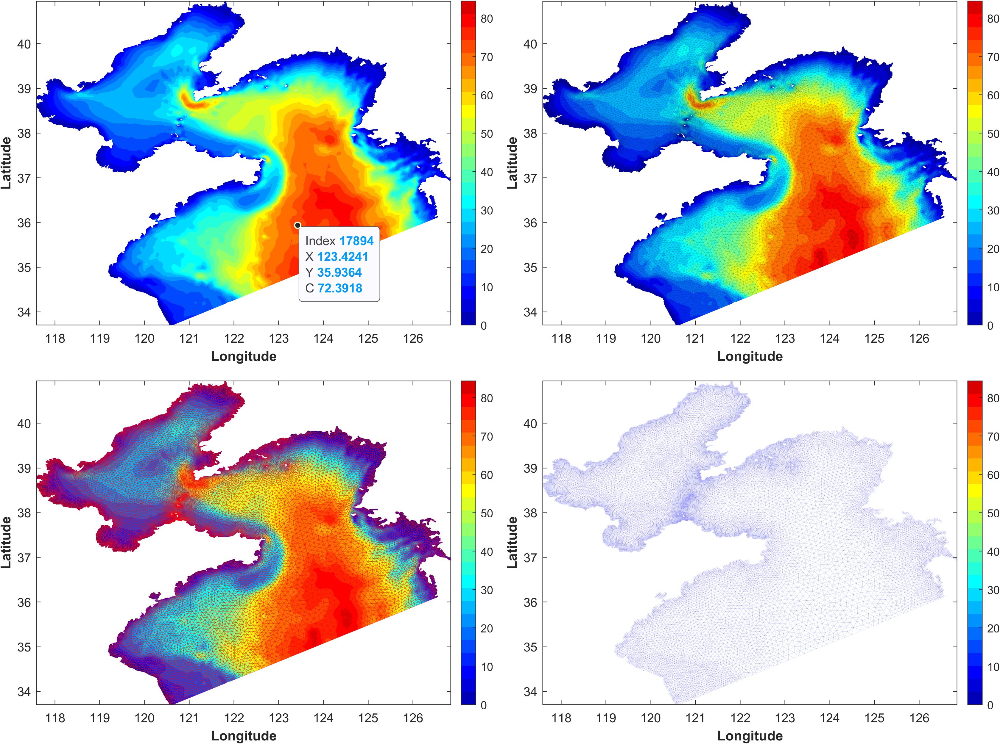
</div>
<p align="center"><strong>Figure 1</strong>. Data visualization on node centers and customized visualization styles, with enhanced datatips.</p>

```matlab
% Variable defined at element centers
figure('Color', 'w')
disp_schism_var(Mobj, Mobj.depthc)
axis image
```

<div align="center">
  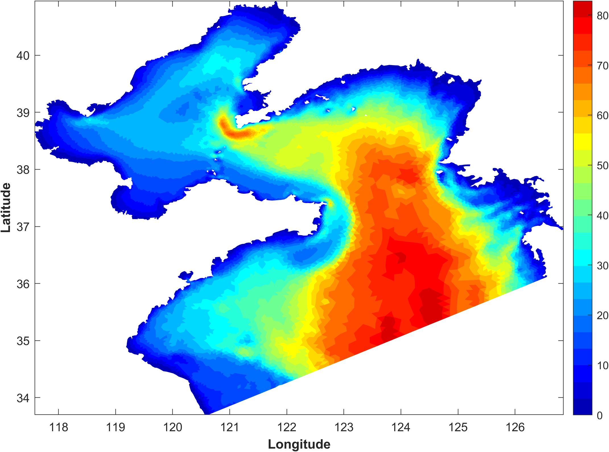
</div>
<p align="center"><strong>Figure 2</strong>. Data visualization on element centers.</p>

```matlab
% Variable defined at side centers
figure('Color', 'w')
disp_schism_var(Mobj, Mobj.depths)
axis image
```

<div align="center">
  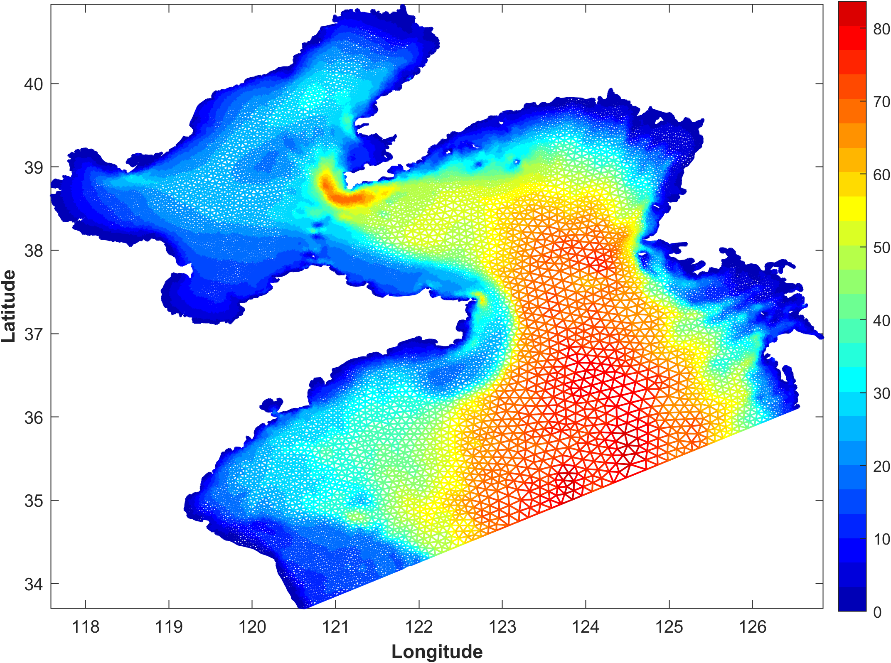
</div>
<p align="center"><strong>Figure 3</strong>. Data visualization on side centers.</p>

## 2. Find values at the bottom layer

Bottom or near-bottom values can be extracted from the 2-D matrix via **get_schout_btm.m**.

```matlab
var_test = Mobj.vgrids; 

% the lowest level
var_btm = get_schout_btm(Mobj, var_test, 0);
figure('Color', 'w')
disp_schism_var(Mobj, var_btm)
axis image
title('sigma depth (0-1)')

% the second-to-last level
var_btm = get_schout_btm(Mobj, var_test, 1);
figure('Color', 'w')
disp_schism_var(Mobj, var_btm)
axis image
title('sigma depth (0-1)')
```

<div align="center">
  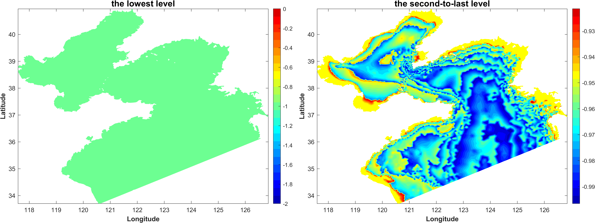
</div>
  <p align="center"><strong>Figure 4</strong>. The sigma layers at bottom and near-bottom layer.</p>

## 3. Define masks on the model grid

**def_schism_mask.m** provides an interactive way to create masks. Simply draw polygons on the map and press `ENTER`. The mask info will then be automatically saved as a MAT file in the target directory. 

All functions beginning with **def_schism** follow a similar usage pattern. First activate a basemap (or use the default one), then draw polygons.

```matlab
var_test = Mobj.depth;

figure('Color', 'w')
disp_schism_var(Mobj, var_test)
axis image
hold on
msk = def_schism_mask(Mobj, 2, 'test', 'rebuild');  % "2" means two separate regions

var_test(msk) = nan;
figure('Color', 'w')
disp_schism_var(Mobj, var_test)
axis image
```

<div align="center">
  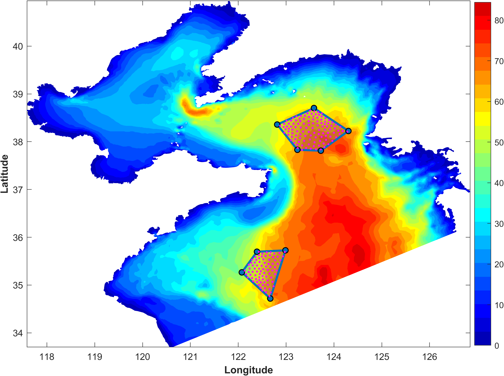
</div>
<p align="center"><strong>Figure 5</strong>. Defining masks on the model grid.</p>

## 4. Convert variables between different grid centers

**convert_schism_var.m** is used to convert data among different grid centers (node, element, side) using weighted averaging.

```matlab
% from nodes to elements
v1 = Mobj.depth;
v2 = convert_schism_var(Mobj, v1, 'node2elem');

figure('Color', 'w')
subplot(211)
disp_schism_var(Mobj, v1)
axis image

subplot(212)
disp_schism_var(Mobj, v2)
axis image
```

```matlab
% from nodes to sides
v1 = Mobj.depth;
v2 = convert_schism_var(Mobj, v1, 'node2side');

figure('Color', 'w')
subplot(211)
disp_schism_var(Mobj, v1)
axis image
subplot(212)
disp_schism_var(Mobj, v2)
axis image
```

```matlab
% from elements to nodes
v1 = Mobj.depthc;
v2 = convert_schism_var(Mobj, v1, 'elem2node');

figure('Color', 'w')
subplot(211)
disp_schism_var(Mobj, v1)
axis image
subplot(212)
disp_schism_var(Mobj, v2)
axis image
```

```matlab
% from sides to nodes
v1 = Mobj.depths;
v2 = convert_schism_var(Mobj, v1, 'side2node');

figure('Color', 'w')
subplot(211)
disp_schism_var(Mobj, v1)
axis image
subplot(212)
disp_schism_var(Mobj, v2)
axis image
```

## 5. Define transect and extract data

**read_schism_transect.m** extracts data along the transect defined by `sect_info`, which is created by **def_schism_transect.m**.

```matlab
% extract data along a straight transect
figure
disp_schism_hgrid(Mobj, [1 0])
axis image
auto_center
hold on
sect_info = def_schism_transect(Mobj, -1); % straight transect

disp_schism_vgrid(Mobj, sect_info)

var_tri = Mobj.depLayers; % test data
[var2d, dist2d, dep2d] = read_schism_transect(Mobj, sect_info, var_tri);

figure
pcolor(dist2d/1e3, dep2d, var2d)
shading flat
colorbar
colormap(jet)
xlabel('Along transect distance (km)')
ylabel('Depth (m)')
```

<div align="center">
  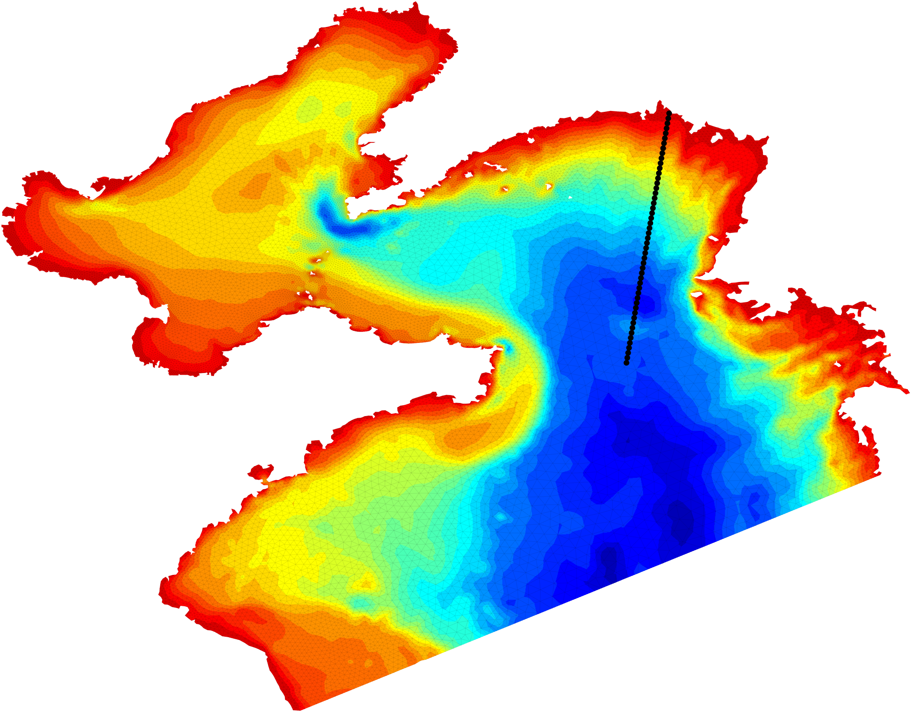
</div>
<p align="center"><strong>Figure 6</strong>. The specified transect on the map.</p>

<div align="center">
  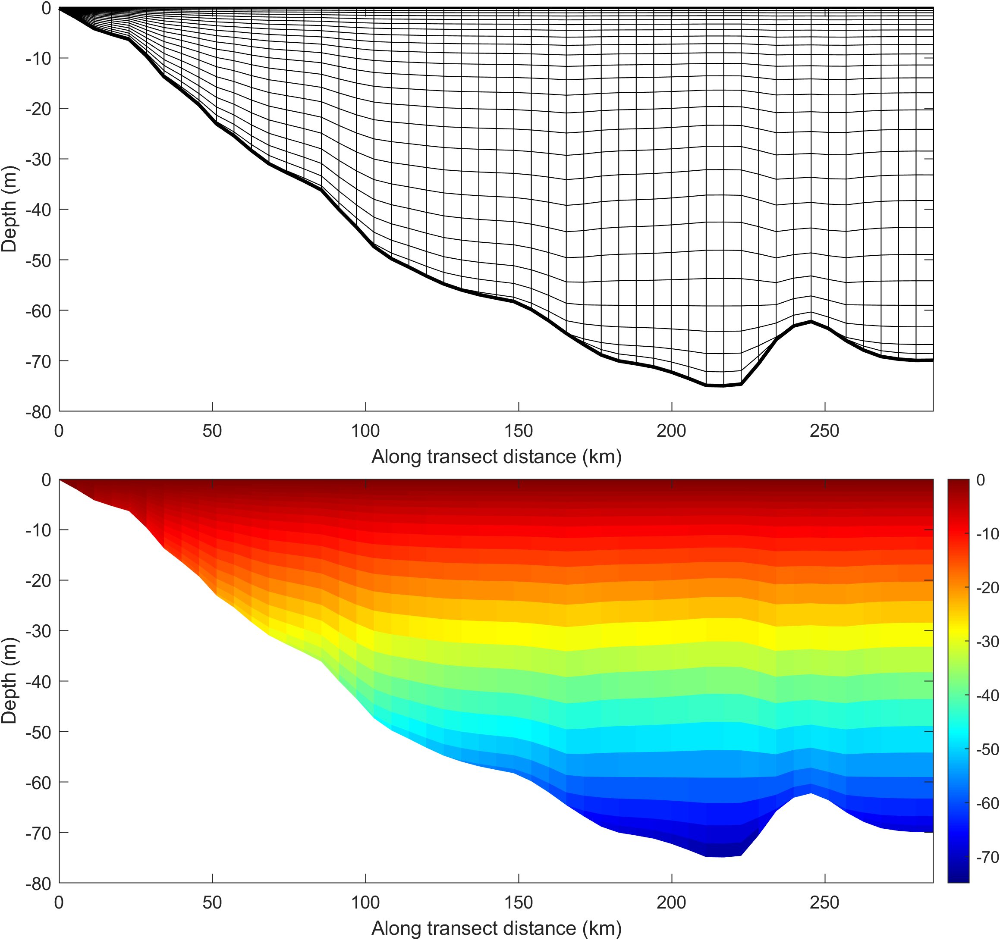
</div>
<p align="center"><strong>Figure 7</strong>. Vertical layers and extracted data along the transect.</p>

**def_schism_transect.m** can define transects of arbitrary shapes (`mtype = -3`) and returns the normal and tangential unit vectors at each point, which can be used for subsequent projection tasks.

```matlab
% define a curved transect along the isobaths
figure
disp_schism_hgrid(Mobj)
clim([-60 0])
sect_info = def_schism_transect(Mobj, -3, 30);  % curved transect

x = sect_info.lon; y = sect_info.lat;
tvec = sect_info.tvec; % tangential unit vector
nvec = sect_info.nvec; % normal unit vector

figure
disp_schism_hgrid(Mobj)
hold on
colormap(turbo(25))
plot_schism_bnds(Mobj)
h1 = plot(x, y, 'LineWidth', 3, 'Marker', '.', 'Color', 'k');
h2 = quiver(x, y, tvec(:,1), tvec(:,2), 0.5, 'r');
h3 = quiver(x, y, nvec(:,1), nvec(:,2), 0.5, 'b');
legend([h1,h2,h3], {'Transect', 'Tangent','Normal'});
```

<div align="center">
  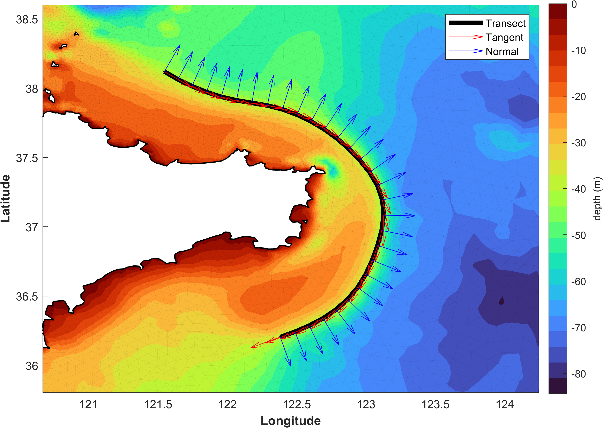
</div>
<p align="center"><strong>Figure 8</strong>. A transect along isobaths and the corresponding normal and tangential unit vectors at each point.</p>

## 6. Extract contour lines and export as shapefiles

**calc_schism_contour.m** extracts contour lines at specified levels and stores them in a shapefile-compatible data structure.

```matlab
levels = [5, 10, 30, 60]; % depth levels
S = calc_schism_contour(Mobj, Mobj.depth, levels);

% bathymetry contour lines
figure
hold on
for ii = 1:length(S)
    plot(S(ii).X, S(ii).Y)
end
legend(string(levels))

shapewrite(S, 'D:\test')  % save as shapefiles if necessary
```

<div align="center">
  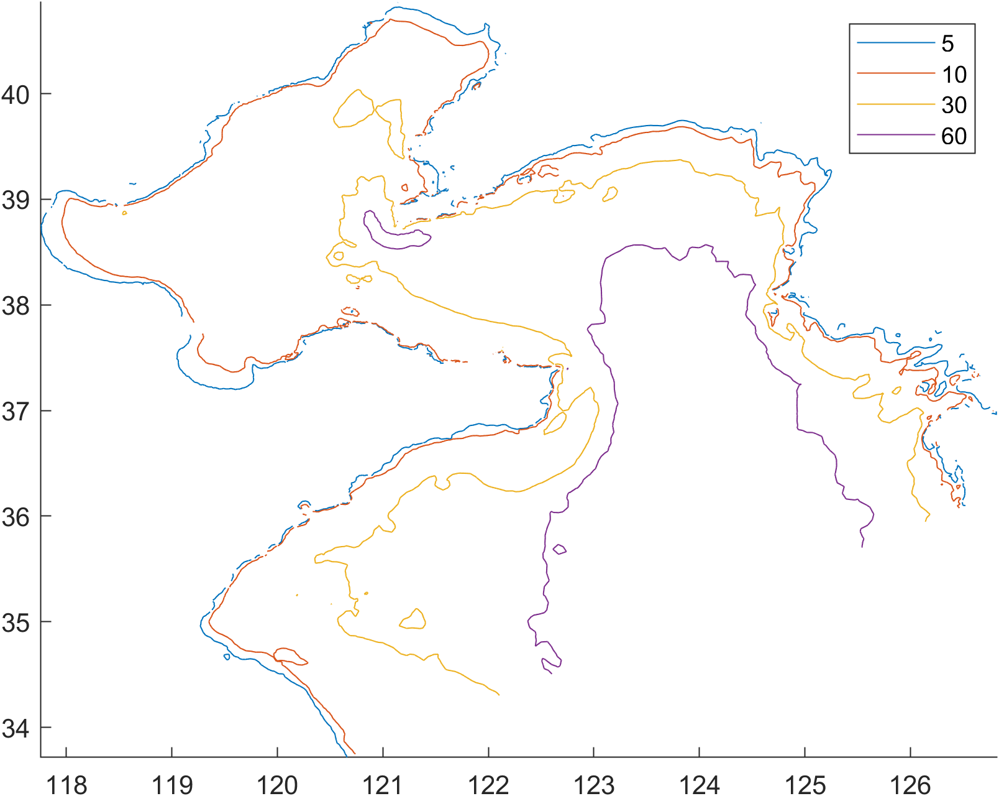
</div>
<p align="center"><strong>Figure 9</strong>. Contour lines at specified depth levels.</p>

## 7. Calculate gradient on unstructured grids

**calc_schism_grad.m** directly calculates the gradient at element centers using finite volume method and works for mixed triangular/quadrangular grid.

```matlab
[Fx, Fy, Fxy] = calc_schism_grad(Mobj, Mobj.depth);

% bathymetry gradient
figure
disp_schism_var(Mobj, Fxy)
caxis([0 0.0025]) 
axis image; auto_center
```

<div align="center">
  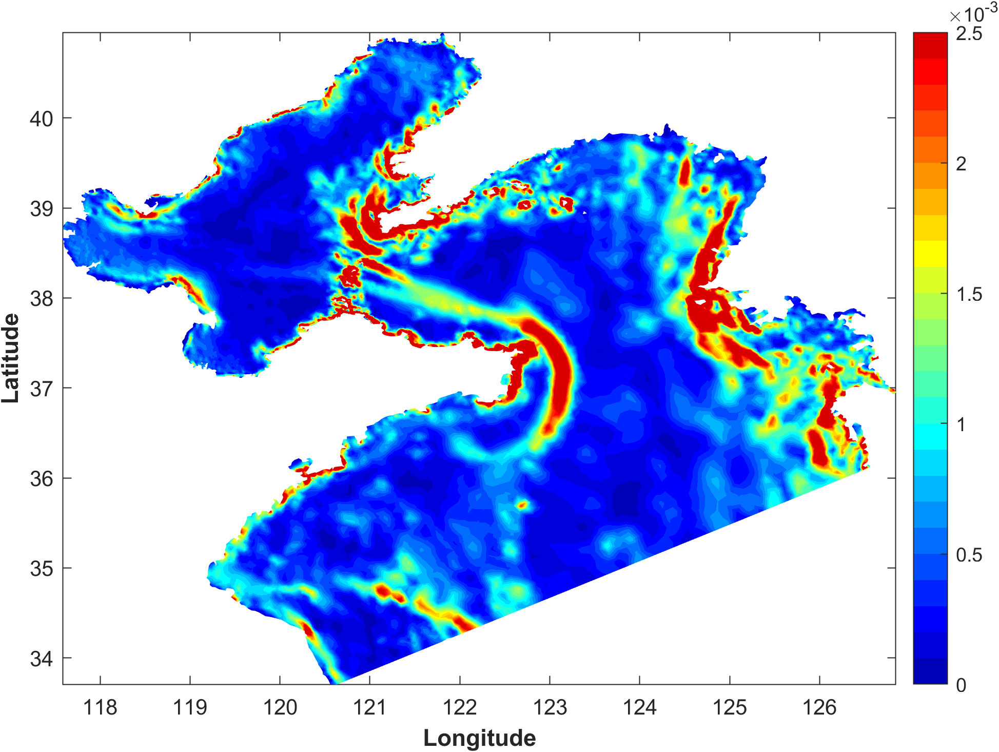
</div>
<p align="center"><strong>Figure 10</strong>. Bathymetry gradient on the model grid.</p>

## 8. Prepare for particle tracking

**write_schism_ptrack.m** is used to generate `particle.bp` file, which is required for particle tracking.

```matlab
figure('Color', 'w')
disp_schism_var(Mobj, Mobj.depth)
axis image
hold on
[lon_list, lat_list] = def_schism_ptrack(Mobj, 1, 'polygon'); % draw a polygon on the map and the selected nodes will emerge

nps = numel(lon_list);
dep_list = repmat(-3, [nps 1]);  % all the particles are released at the 3-m depth
xyz_data = [lon_list(:), lat_list(:), dep_list(:)];
drop_time_list = repmat(datetime(2020,6,3), [nps 1]);  % all the particles are released on 3 Jun 2020.
life_day = 3;
ptrack_vars = [1 0 1 0];

% particle.bp file can be found in 'Exp1_BYS/inputs'
write_schism_ptrack(Mobj, xyz_data, drop_time_list, life_day, ptrack_vars)
```

## 9. Generate station.in file

**write_schism_station_in.m** is used to generate `station.in` file, which is required for station output.

```matlab
figure('Color', 'w')
disp_schism_var(Mobj, Mobj.depth)
axis image
hold on
[lon_list, lat_list] = def_schism_ptrack(Mobj, 1, 'polygon');  % draw a polygon on the map and the selected nodes will emerge

nps = numel(lon_list);
xyz_data = [lon_list(:), lat_list(:), dep_list(:)];
switch_flags = [1 1 1 1 1 1 1 1 1];

% station.in file can be found in 'Exp1_BYS/inputs'
write_schism_station_in(Mobj, xyz_data, switch_flags)
```

## 10. Re-define the open boundaries

**def_schism_obc.m** defines the open boundaries with an interactive way, and it is useful to set up river open boundaries.

```matlab
obc_counts = 2;  % two open boundaries will be defined.
Mobj2 = def_schism_obc(Mobj, obc_counts);

% draw two polygons on the map, ensuring that each polygon encloses a
% contiguous boundary segment.

figure
disp_schism_hgrid(Mobj2, [0 1])
```

<div align="center">
  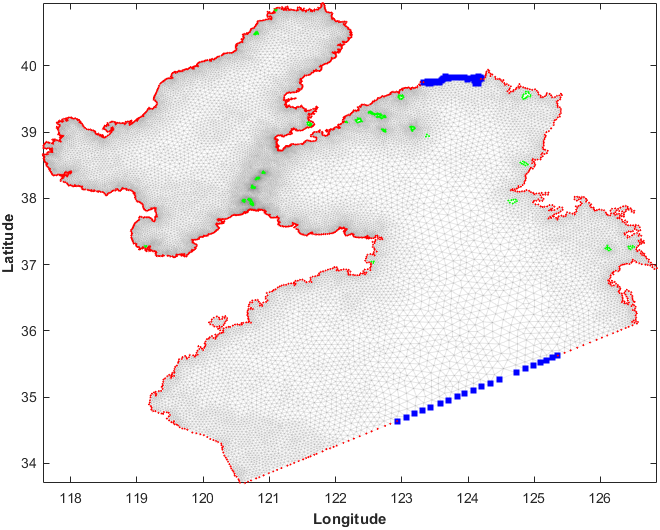
</div>
<p align="center"><strong>Figure 11</strong>. Updated model grid with new open boundaries.</p>
