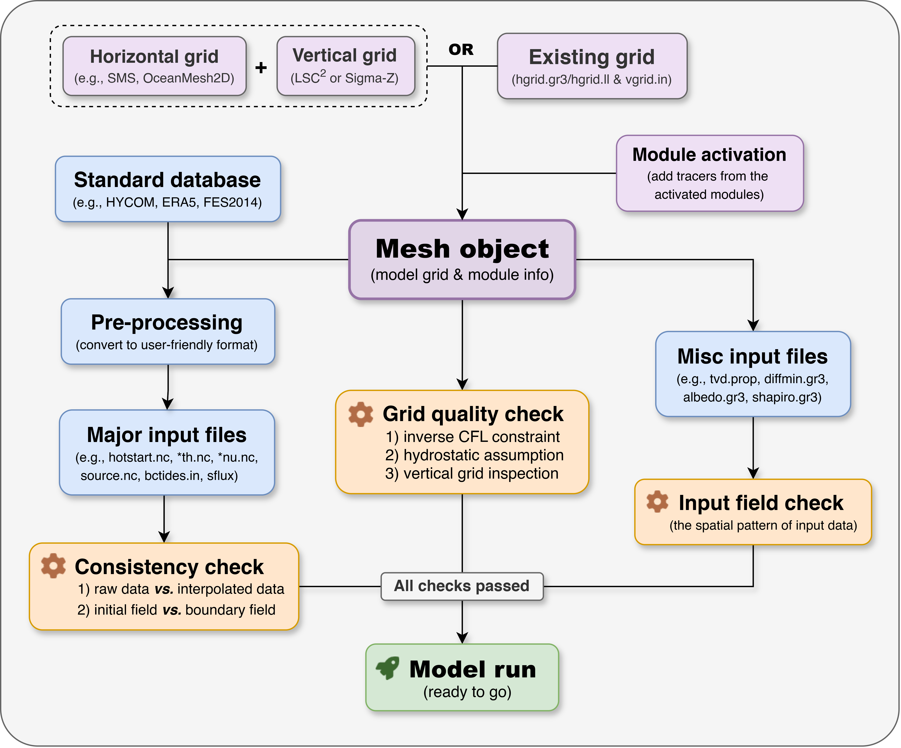

# Summary

Numerical modeling has become an indispensable tool for simulating hydrodynamic processes and supporting ecosystem research. However, configuring numerical models often involves a steep learning curve and requires substantial time investment in data pre- and post-processing. The Semi-implicit Cross-scale Hydroscience Integrated System Model (SCHISM), as one of the state-of-the-art ocean modeling systems [@zhang2016seamless], has been successfully applied to a wide range of oceanic and coastal environments [@ye2020simulating; @amores2022numerical; @mentaschi2023global]. This paper presents a newly developed MATLAB package, [`schism-toolbox`](https://github.com/wenfanwu/schism-toolbox), designed to lower the entry barrier for SCHISM users. The toolbox offers a flexible and efficient workflow for handling SCHISM input and output files, leveraging MATLAB’s strong capabilities in vectorized operation and interactive data analysis.

# Statement of need

SCHISM is a three-dimensional, hydrostatic, and baroclinic ocean modeling system grounded on unstructured grids [@zhang2016seamless]. It is an advanced derivative of the original Semi-implicit Eulerian-Lagrangian Finite-Element (SELFE) model [@zhang2008selfe] and distributed with an open-source Apache v2 license. This model has undergone significant enhancements, including extensions to large-scale eddy-resolving regimes and a seamless cross-scale capability spanning from small creeks to the open ocean. 

Nowadays, SCHISM has been widely applied across a broad range of oceanographic settings worldwide, demonstrating robust skills in simulating hydrodynamic processes and supporting biogeochemical studies [@ye2020simulating; @liu2018san; @cai2023sea]. The model has fostered a large and expanding user community, drawing researchers from diverse fields such as physical oceanography, ocean engineering, and marine ecology. Several tools have been developed to support SCHISM's pre- and post-processing workflows, including Python-based packages like [`pyschism`](https://github.com/schism-dev/pyschism) and [`pylibs`](https://github.com/wzhengui/pylibs), as well as official Fortran utilities. However, MATLAB-based tools remain relatively scarce.

To this end, `schism-toolbox` was developed to support the needs of the user community. Leveraging MATLAB’s powerful vectorized operations and interactive visualization, it offers an efficient, user-friendly workflow for data processing and analysis, with minimal dependence on external packages. This workflow allows users to rapidly set up hydrodynamic or coupled hydrodynamic-biogeochemical simulations with SCHISM, provided that a standardized database is available.

Figure 1 illustrates a typical workflow of the toolbox, which adopts a modular design to improve usability and maintainability. During the setup process, grid information and activated modules are stored in a mesh object named `Mobj`, which globally manages the model configuration within the toolbox. Data preparation is generally organized into three modular steps: raw data extraction, format standardization (conversion to a user-friendly structure), and interpolation onto the SCHISM grid. A comprehensive quality check is implemented for both the model grid and input data to ensure the accuracy and consistency of the input files. In addition, the toolbox provides a suite of utility functions for working with unstructured grids, including variable visualization, gradient computation, contour line extraction, and more.

# Acknowledgements

The first author would like to express gratitude to the users who provided feedback during the development phase, and to the reviewers for their constructive and valuable comments that helped improve the quality of this software.

# References